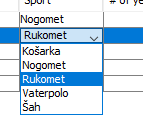

# IZMJENE NA BAZI

1. Trenutno `player_info` tabela sadrži kolone:
   1.1 `id`  
   1.2 `first_name`  
   1.3 `last_name`  
   1.4 `sport` -> **OVA KOLONA je trenutno tipa VARCHAR(45)**  
   1.5 `years`  
   1.6 `vegetarian`  
   1.7 `color`

2. Potrebno je dodati dodatnu tabelu `sport` koja ima kolone:
    - `id` **PRIMARNI KLJUČ**
    - `name`
    - `description`

3. Nakon dodavanja nove tabele `sport`:
    - Ažurirati kolonu **1.4 `sport`** i promijeniti joj tip iz `VARCHAR(45)` u **isti tip** koji ima `id` kolona u tabeli `sport`. *(MORA BITI isti tip zbog relacija)*

4. Kada promijenite tip kolone **1.4 `sport`** u tabeli `player_info`, povezati tu kolonu s kolonom `id` u tabeli `sport`:
    - `id` -> `sport` = **PRIMARNI KLJUČ**
    - `sport` -> `player_info` = **FOREIGN KEY**

---

# IZMJENE NA GUI DIJELU APLIKACIJE

1. Izmijeniti i ažurirati PlayerInfoDao, a zatim dodati odgovarajući SportDao i klasu Sport koja predstavlja sport tabelu iz baze.
2. Nakon toga doraditi GUI dio aplikacije na način da onemogućimo slobodno editovanje ćelije sport. Odnosno  potrebno je da ćeliju sport editujemo kroz combo box.
3. 